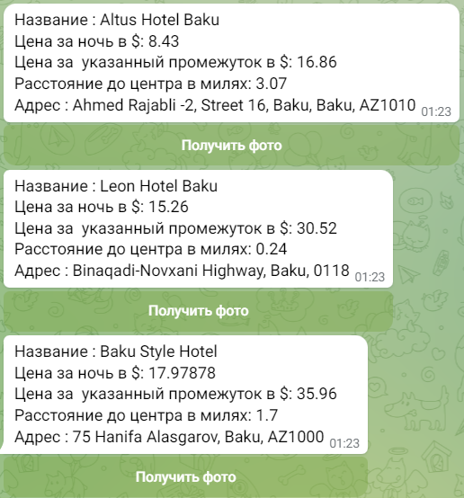
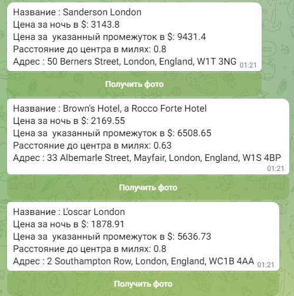
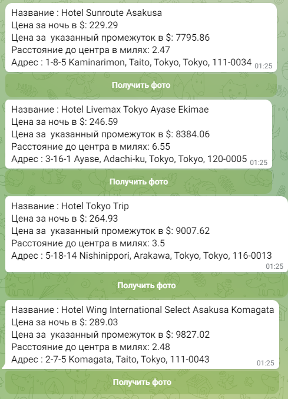
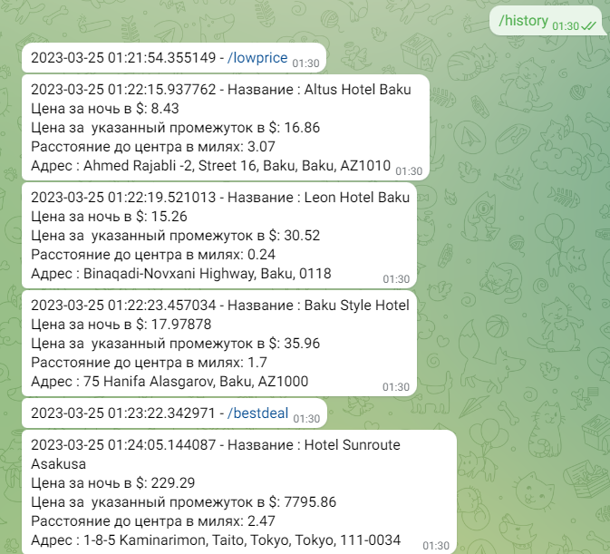

Bot_helper

Данный бот помогает в поиске отелей по необходимым параметрам.
Для старта работы программы необходимо ввести команду /hello-world или отправить любое сообщение,
после чего бот предложит вам ознакомится со списком возможных команд и их описанием.


___

### Список команд

1. __/lowprice__ - вывод самых дешёвых отелей в городе
2. __/highprice__ - вывод самых дорогих отелей в городе
3. __/bestdeal__ - вывод ближайших к центру отелей и наиболее подходящих по цене
4. __/history__ - вывод истории поиска отелей

___

#### Команда /lowprice

1. __Бот__ запрашивает город поиска отелей
2. Количество вывода отелей
3. Даты проживания (не ранее текущей даты на момент запроса)


_Пример вывода_




___

#### Команда /highprice

1. __Бот__ запрашивает город поиска отелей
2. Количество вывода отелей стоимостью более 450$
3. Даты проживания (не ранее текущей даты на момент запроса)


_Пример вывода_



___

#### Команда /bestdeal

1. __Бот__ запрашивает город поиска отелей
2. Количество вывода отелей
3. Даты проживания (не ранее текущей даты на момент запроса)
4. Ценовой диапазон поиска 


_Пример вывода_



___

#### Команда /history

При вводе команды, на экран выводится история запросов и список найденных отелей

_Пример вывода_



___

### Используемые библиотеки
``` python
pyTelegramBotAPI==4.10.0
requests==2.28.2
```

___
### Архитектура
* __main.py__ - основной файл для работы бота
* __func_file.py__ - вспомогательный файл с функциями


